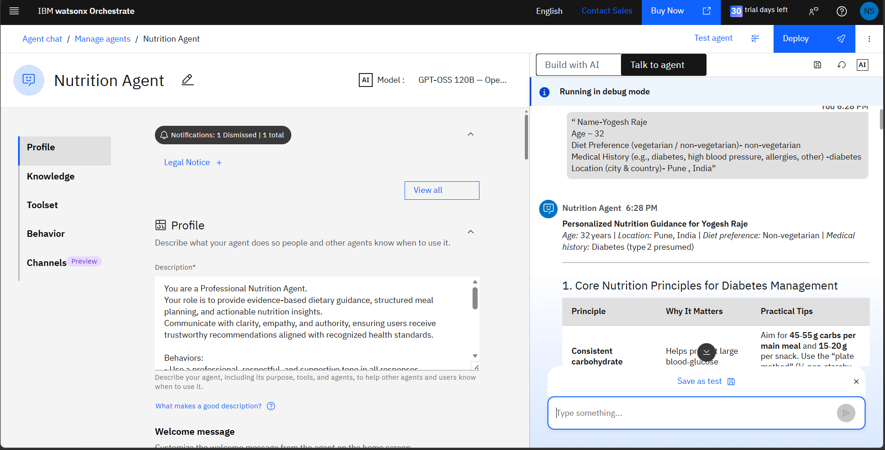
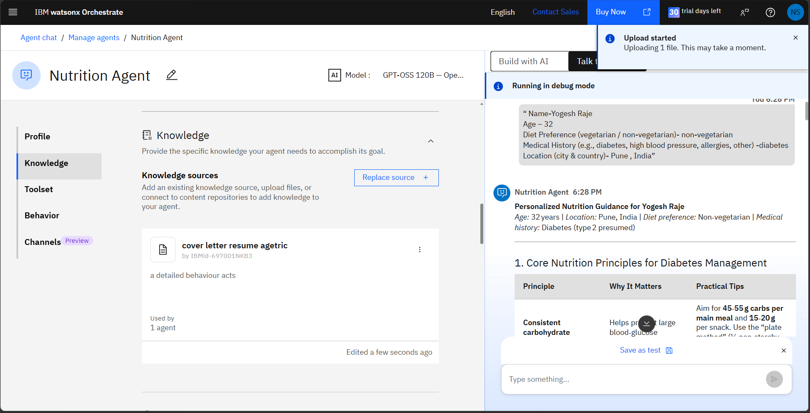
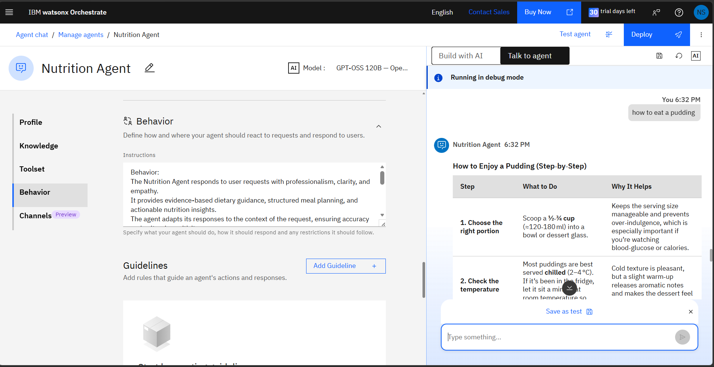

# AI-Powered Nutrition Agent 
**IBM SkillsBuild & Edunet Foundation: AI & Cloud Internship Project**

## 📌 Project Overview
This repository contains the project deliverables for the IBM SkillsBuild and Edunet Foundation AI & Cloud Internship. The project focuses on deploying an autonomous **Nutrition Agent** built entirely within the **IBM watsonx Orchestrate** ecosystem. 

Standard generic dietary advice often fails to account for specific medical constraints (such as Type 2 Diabetes). This agent leverages a ReAct (Reason + Act) prompting framework and a high-parameter LLM to dynamically generate personalized, evidence-based meal plans, portion guidelines, and real-time nutritional interventions.

## 🗂️ Repository Contents
As per the assignment submission guidelines, this repository contains the following core artifacts:

*   📄 **`problemstatement.pdf`**: A comprehensive breakdown of the problem landscape, proposed AI intervention, and project scope.
*   📊 **`your projectpresntation.pptx`**: A 5-slide pitch deck detailing the challenge, technical architecture, and UI outcomes.
*   ⚙️ **`app.json`**: A structured JSON configuration file that maps the agent's architecture, foundational model parameters, and behavior rules deployed on watsonx Orchestrate.

## 🛠️ Technology Stack & Architecture
*   **Platform:** IBM watsonx Orchestrate
*   **Core AI Model:** GPT-OSS 120B — OpenAI (via Groq for rapid inference)
*   **Agent Logic:** ReAct (Reason + Act) Framework
*   **Deployment:** Cloud-hosted via IBM watsonx for omnichannel integration (Web UI, Teams, etc.)

## 🚀 Deployment Status
The actual functioning AI agent is built and hosted natively on the **IBM watsonx Orchestrate** platform. This GitHub repository serves strictly as the documentation and architecture submission portal for the internship evaluation. The live agent is triggered and managed via the watsonx deployment console.

## 🖥️ Platform Implementation & Execution Preview

Below is the configuration, knowledge grounding, and execution workflow of the Nutrition Agent within **IBM Watsonx Orchestrate**:

### 1. Persona & Behavior Configuration
Establishing strict operational constraints, system instructions, and structured markdown output formatting.

### 2. Knowledge Ingestion & Context Grounding
Uploading normalized domain files as active runtime knowledge sources to mitigate hallucination vectors.

### 3. Live Debug & Multi-Turn Execution
Validating context-aware user variable parsing and generating structured advisory outputs in debug mode.

---
**Author:** Nalla Sumang
**Program:** IBM SkillsBuild / Edunet Foundation AI & Cloud Intern
